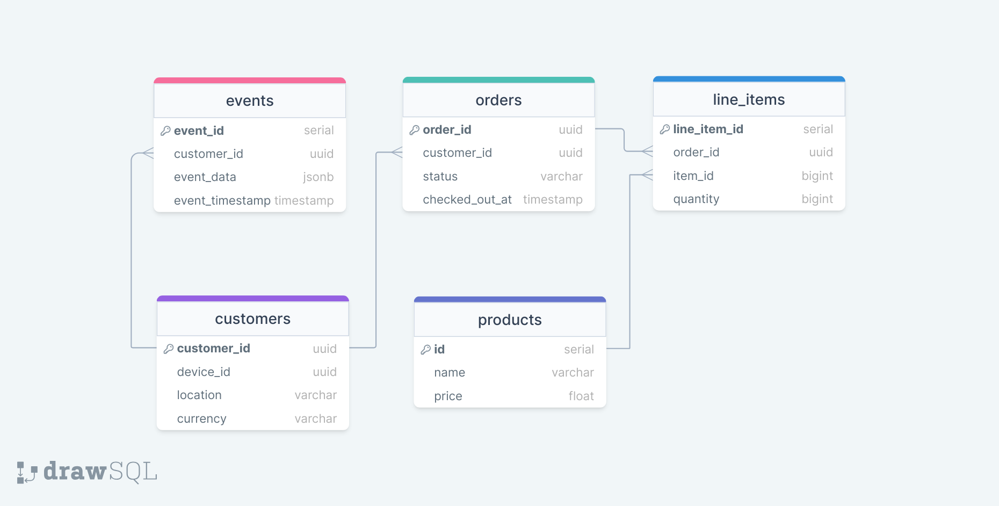

# E-commerce Database Exploration Project

This is an E-commerce Database Exploration project. In this project, I dive into data provided by an e-commerce startup. My goal is to analyze this data to gain insights into customer behavior, orders, and interactions with the platform.

## Project Structure

The project repository contains the following files and folders:

- **data:** This folder contains the dataset provided by the e-commerce startup. It includes event-level data capturing customer activities on the platform, customer data, products data, orders data and line items data.
- **infra_setup:** Here, you'll find the necessary setup files for the infrastructure, including an `init.sql` script for initializing the PostgreSQL database.
- **queries:** Contains an `queries.sql` file where I provide SQL statements to answer domain specific business questions.
- **.gitignore:** Specifies intentionally untracked files to ignore.
- **docker-compose.yml:** Defines the services, networks, and volumes required for the Docker setup.
## About the Data
- customers: Contains information about customers, such as their unique identifiers, device identifiers, locations and their currency.
- events: Stores data related to customer events on the e-commerce platform, including customer ID timestamps, event data like event types e.g. visits, checkout and add to and removal from cart.
- products: Holds details about the products available, such as their IDs, names, and prices.
- orders: Holds information about orders placed on the platform. The order ID, the customer ID, the status of the order(success, failed or cancelled), and the checkout time.
- line_items: Holds information regarding individual products in an order. The order ID, product ID, the quantity of the product ordered.

### Caveats
- Due to some discrepancies in the data, it is wise to consider the events data the single source of ground truth.
- It is also imperative not to define explicit relationship constraints between tables when creating them(If you chose to edit the `init.sql` file)
  

## Setting Up the Server

To get started, follow these steps:

- Clone or fork this repository to your local machine.
- Navigate to the project root folder.
- Run `docker-compose up` in your terminal.
- This command will start the PostgreSQL and pgadmin services.
- Once the containers are created, you can connect to the database from pgadmin using the following credentials:
  ### Pgadmin:
    - username: admin@admin.com
    - password: root
  ### Postgres:
   - Username: ecomm_user
   - Password: secretPassw0rd
   - Database: ecomm_db
   - Port: 5432
   - Host: postgres

The `queries/queries.sql` file contains SQL queries designed to answer specific business questions. Each query is crafted to extract valuable insights from the database, addressing various aspects of business operations. Here's an overview of the nature of these queries:

- **Top Ordered Products Analysis:** This query aims to identify the most ordered product by analyzing successful checkout events. Due to the unreliability of the orders and line_items tables, the events table is used as the primary source of truth. The query involves several steps, including identifying items added to carts, excluding those that were later removed, and counting the occurrences of each product in successfully checked-out carts. To achieve this, multiple Common Table Expressions (CTEs) are employed to filter and process the data effectively.
- **Top Spenders Analysis:** To determine the top spenders on the e-commerce platform, this query calculates the total amount spent by each customer on successful orders. Similar to the previous query, it relies on the events table for accurate data. By filtering events related to successful checkouts and considering only customers who completed a checkout, the query identifies top spenders based on their purchase behavior.
- **Checkout Location Analysis:** This query focuses on identifying the most common location where successful checkouts occur. By grouping events by location and counting successful checkouts, it provides insights into geographical preferences of customers.
- **Cart Abandonment Analysis:** This query aims to understand customer behavior by identifying customers who abandoned their carts and counting the number of events before abandonment. It excludes visits and failed checkouts to focus solely on cart interactions i.e., adding products and removing products from their carts.
- **Average Visits Analysis:** Calculating the average number of visits per customer, considering only those who completed a checkout, this query offers insights into customer engagement and purchasing behavior. By filtering events based on event types and customer behavior, the query provides a metric for evaluating the effectiveness of marketing campaigns and website usability in converting visits into successful transactions.

If you have any questions or need assistance, feel free to reach out.
